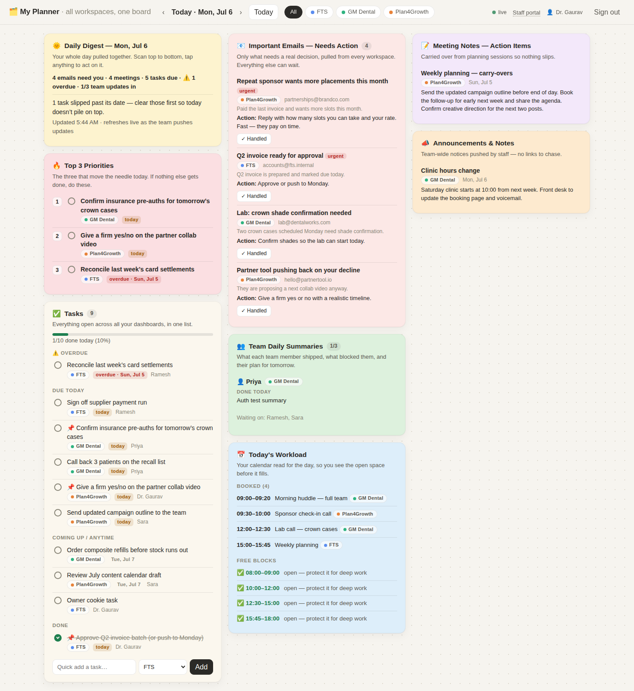

# My Planner — unified daily dashboard

An xtiles-style daily board that pulls **emails, tasks, meetings, notes and team
daily summaries from every workspace you run** (FTS, GM Dental, Plan4Growth — and
any new one you invent) onto one page. Staff push updates from their own portal
or from scripts, and the board updates live.



## The two sides

| Page | Who | What |
|---|---|---|
| `/` (index.html) | You | The board: Daily Digest, Top 3 Priorities, unified Tasks, Important Emails, Team Daily Summaries, Today's Workload with free blocks, Meeting Notes, Announcements |
| `/staff.html` | Your team | Sign in with a personal API key, then submit daily summaries, flag emails that need you, add tasks/events/notes — each lands on your board instantly |

## Quick start

```bash
npm install
OWNER_PASSWORD=your-strong-password npm start   # http://localhost:3000
```

Open the board and you'll be sent to `/login.html` — sign in with that password.
The first run seeds a demo database (`data/db.json`) with the three workspaces
and demo staff. Reset it any time with `npm run seed`.

If you don't set `OWNER_PASSWORD`, the app falls back to `changeme` and prints a
warning — fine for a quick local look, never for a public deployment.

## Authentication

Two separate identities, by design:

- **You (owner)** sign in with a password (`OWNER_PASSWORD`). That creates a
  server-side session and an `HttpOnly` cookie; **the board and its live stream
  require this session** — reads are no longer open. The password is never
  stored in plaintext beyond the env var (scrypt hash + constant-time compare),
  and sessions persist in the data store so a redeploy doesn't log you out.
- **Staff** push data with a personal key in the `x-api-key` header. Keys live in
  `data/db.json` under `staff` — edit that file to rename people, rotate keys, or
  add team members. Staff keys can *write* (push) but cannot read your board.

### Demo staff keys (rotate before real use)

| Person | Role | Key |
|---|---|---|
| Priya | Front desk (GM Dental) | `priya-demo-key` |
| Ramesh | Accounts (FTS) | `ramesh-demo-key` |
| Sara | Marketing (Plan4Growth) | `sara-demo-key` |

## Deploy

The app is a plain Node/Express server with no build step. It needs two things
in production: `OWNER_PASSWORD` set to a strong secret, and a **persistent disk**
for `data/db.json` (point `DATA_DIR` at it) so nothing is lost on redeploy.

**Render (one blueprint, includes the disk):**
1. Push this repo to GitHub (done — it's on the PR branch).
2. Render → **New → Blueprint** → pick this repo. `render.yaml` provisions the
   web service and a 1 GB disk at `/var/data` automatically.
3. When prompted, set **`OWNER_PASSWORD`**. Deploy.
4. You get `https://<name>.onrender.com` — the owner board. `/staff.html` is the
   staff portal. `SECURE_COOKIES` turns on automatically via `NODE_ENV=production`.

**Anywhere else (Railway, Fly, a VPS):** set `OWNER_PASSWORD`, `DATA_DIR` (a
writable persistent path) and `NODE_ENV=production`, then `npm start`. A
`Procfile` is included for buildpack-based hosts. See `.env.example` for the full
list of environment variables.

## What makes the board smart

- **Daily Digest** — auto-generated every refresh: emails needing you, meetings,
  tasks due, overdue count, how many team updates are in, plus a one-line read of
  the day.
- **Top 3 Priorities** — computed, not hand-picked: pinned tasks first, then
  P1s due soonest, overdue floats up.
- **Unified Tasks** — one list across all workspaces with colour-coded tags,
  grouped Overdue / Due today / Coming up / Done, progress bar and quick-add.
- **Team Daily Summaries** — what each member shipped, blockers, tomorrow's plan;
  shows who you're still waiting on. Resubmitting replaces that day's entry.
- **Today's Workload** — bookings plus computed free blocks (gaps ≥ 45 min
  between 08:00–18:00) so you can protect deep-work time.
- **Live** — the board listens on a server-sent-events stream; anything a staff
  member or script pushes shows up without a refresh (90 s polling as fallback).
- **Day navigation & workspace filter** — flip between days, or filter every tile
  to a single business with one chip.
- Dark mode follows your system setting; layout works on a phone.

## Push API — connect your other dashboards

Anything that can send an HTTP request can feed this board: your FTS system,
GM Dental practice software exports, Plan4Growth tools, Zapier/Make, a Google
Apps Script watching a Gmail label, or a cron job.

`POST /api/push` with header `x-api-key: <key>`. Body is one item or an array.
Unknown workspaces are created automatically.

```bash
# a task
curl -X POST https://your-host/api/push \
  -H 'Content-Type: application/json' -H 'x-api-key: priya-demo-key' \
  -d '{"type":"task","data":{"title":"Call lab about crown case","workspace":"gmdental","due":"2026-07-06","priority":1,"pinned":false,"assignee":"Priya"}}'

# an email that needs a decision
curl -X POST https://your-host/api/push \
  -H 'Content-Type: application/json' -H 'x-api-key: ramesh-demo-key' \
  -d '{"type":"email","data":{"subject":"Q2 invoice approval","from":"accounts@fts","snippet":"Batch ready","action":"Approve or push to Monday","urgency":"high","link":"https://mail.google.com/...","workspace":"fts"}}'

# a daily summary (one per member per day — resubmit to replace)
curl -X POST https://your-host/api/push \
  -H 'Content-Type: application/json' -H 'x-api-key: sara-demo-key' \
  -d '{"type":"summary","data":{"wins":"Campaign draft done","blockers":"Waiting on ad budget sign-off","tomorrow":"Launch A/B test"}}'

# batch: an event + a note in one call
curl -X POST https://your-host/api/push \
  -H 'Content-Type: application/json' -H 'x-api-key: priya-demo-key' \
  -d '[{"type":"event","data":{"title":"Lab call","date":"2026-07-06","start":"12:00","end":"12:30","workspace":"gmdental"}},
       {"type":"note","data":{"kind":"announcement","title":"New Saturday hours","body":"Clinic opens 10:00 from next week"}}]'
```

### Full API

| Method & path | Auth | Purpose |
|---|---|---|
| `POST /api/login` | none | `{"password":"…"}` → sets the owner session cookie |
| `POST /api/logout` | session | Ends the session |
| `GET /api/session` | none | `{"authed":true,"name":"…"}` — used by the board to gate |
| `GET /api/board?date=YYYY-MM-DD` | **session** | Everything the board renders for that day |
| `POST /api/push` | session **or** key | Create `task` / `email` / `summary` / `event` / `note` (single or batch) |
| `PATCH /api/tasks/:id` | session | `{"status":"done"\|"open"}` and/or `{"pinned":true}` |
| `PATCH /api/emails/:id` | session | `{"handled":true}` |
| `GET /api/me` | key | Who a staff key belongs to |
| `GET /api/stream` | **session** | Server-sent events; fires on every change |

"session" = owner cookie from `/api/login`; "key" = staff `x-api-key` header.

Field notes: `priority` is 1 (must) / 2 (should) / 3 (nice); dates are
`YYYY-MM-DD`; times are `HH:MM`; `urgency` is `high`/`normal`/`low`;
`note.kind` is `meeting` or `announcement`. If `workspace` is omitted the
sender's home workspace is used.

### Gmail auto-feed idea

In Gmail, create a label like `Needs-Doctor`. A small Google Apps Script
time-trigger can scan the label and forward each thread to `/api/push` as an
`email` item (subject, sender, snippet, link), then remove the label. Your board
becomes the one inbox that only ever shows decisions.

## Architecture

- `server.js` — Express API + static hosting + SSE broadcast
- `lib/auth.js` — password hashing (scrypt), session tokens, cookie helpers
- `lib/store.js` — JSON file persistence (`$DATA_DIR/db.json`, atomic writes)
- `lib/seed.js` — demo data, regenerated relative to today
- `public/` — login (`login.html`), owner board (`index.html`, `app.js`) and
  staff portal (`staff.html`, `staff.js`), plain HTML/CSS/JS, no build step
- `render.yaml` / `Procfile` / `.env.example` — deployment

Single small Node process, one JSON file, deployable on any $5 VPS,
Render/Railway free tier, or a spare machine at the clinic.
